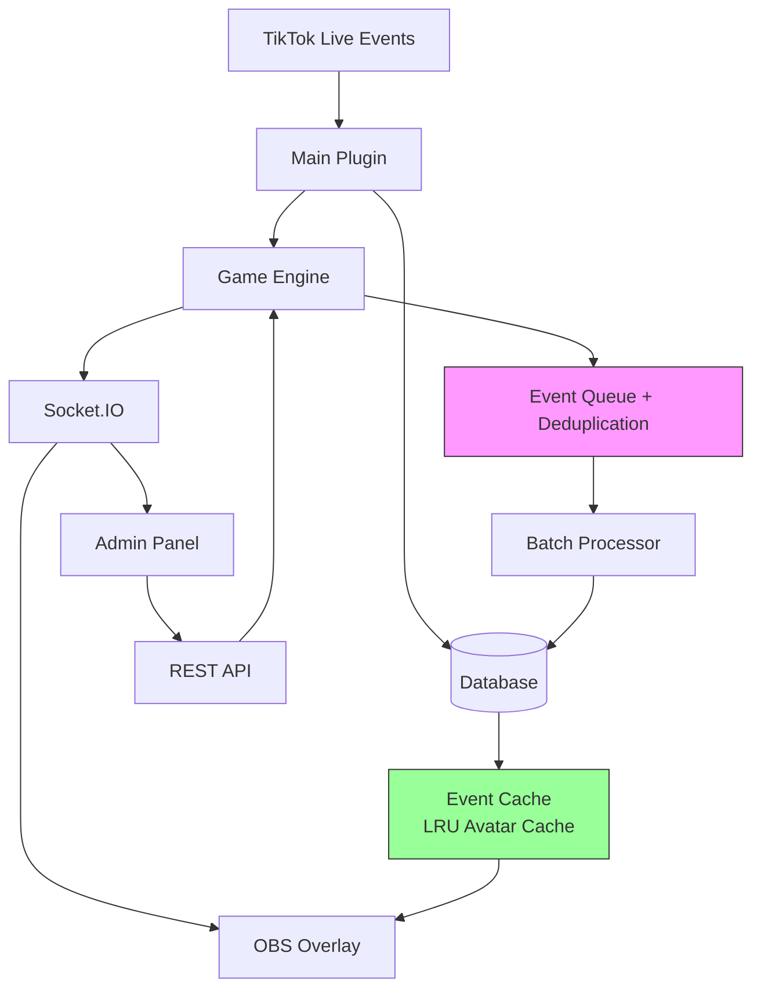

# CoinBattle Plugin - Complete Enhancement Implementation Plan

**Status:** Phase 1 Complete (Event Idempotency) | 30 Tasks Remaining  
**Estimated Total Effort:** 170-250 hours  
**Current Progress:** 5% complete

---

## ✅ Phase 1 Complete: Event Idempotency (P0)

**Implemented:**
- Event deduplication with dual-layer checking
- Idempotency keys in database schema
- Automatic cache cleanup
- Prevents coin replay attacks

**Security Test:** ✅ PASS - Duplicate events rejected

---

## 🔄 Phase 2: Remaining P0 Fixes (Critical - Must Complete)

### Fix #2: Rate Limiting [STARTED]

**Files to modify:**
- `main.js` - Add rate limiter middleware

**Implementation:**
```javascript
// Already started in main.js
// Complete by applying limiters to all endpoints:
//  - Strict (10/min): match control, multiplier
//  - Moderate (30/min): config updates
//  - Relaxed (100/min): state reads

// Add to each route:
this.api.registerRoute('POST', '/api/plugins/coinbattle/match/start', 
  createLimiter(strictLimiter), (req, res) => { ... });
```

**Test Case:**
```bash
# Send 15 requests in 1 minute
for i in {1..15}; do curl -X POST localhost:3000/api/plugins/coinbattle/match/start; done
# Expected: First 10 succeed, next 5 return 429
```

---

### Fix #3: Content Security Policy

**Files to modify:**
- `overlay/overlay.html` - Add CSP meta tag
- `ui.html` - Add CSP meta tag
- `main.js` - Add CSP headers to routes

**Implementation:**
```html
<!-- Add to <head> in both HTML files -->
<meta http-equiv="Content-Security-Policy" content="
  default-src 'self';
  script-src 'self' 'unsafe-inline' https://cdn.socket.io;
  style-src 'self' 'unsafe-inline';
  img-src 'self' data: https:;
  connect-src 'self' ws: wss:;
  font-src 'self';
  object-src 'none';
  base-uri 'self';
  form-action 'self';
">
```

**Server-side (main.js):**
```javascript
// Add middleware before routes
this.api.registerRoute('GET', '/plugins/coinbattle/overlay', (req, res, next) => {
  res.setHeader('Content-Security-Policy', 
    "default-src 'self'; script-src 'self' https://cdn.socket.io; ...");
  next();
}, overlayHandler);
```

---

### Fix #4: Atomic Match Operations

**Files to modify:**
- `engine/game-engine.js` - Add locking mechanism

**Implementation:**
```javascript
class CoinBattleEngine {
  constructor(...) {
    // ... existing code ...
    this.matchEndLock = false;
  }

  async endMatch() {
    // Atomic lock to prevent concurrent calls
    if (this.matchEndLock) {
      this.logger.warn('Match end already in progress');
      return null;
    }

    this.matchEndLock = true;
    try {
      // ... existing endMatch logic ...
      return result;
    } finally {
      this.matchEndLock = false;
    }
  }
}
```

**Test Case:**
```javascript
// Concurrent match end test
Promise.all([
  engine.endMatch(),
  engine.endMatch(),
  engine.endMatch()
]);
// Expected: Only one succeeds, others return early
```

---

### Fix #5: Database Transactions

**Files to modify:**
- `backend/database.js` - Wrap operations in transactions

**Implementation:**
```javascript
endMatch(matchId, winnerData) {
  // Begin transaction
  const transaction = this.db.transaction(() => {
    // Update match
    this.db.prepare(`UPDATE coinbattle_matches SET ...`).run(...);
    
    // Update participants (multiple updates)
    for (const participant of participants) {
      this.updatePlayerLifetimeStats(...);
      this.checkAndAwardBadges(...);
    }
    
    // Update match stats
    this.updateMatchStats(matchId);
  });

  // Execute transaction (all-or-nothing)
  try {
    transaction();
  } catch (error) {
    this.logger.error(`Transaction failed: ${error.message}`);
    throw error;
  }
}
```

---

### Fix #6: Batch Database Writes

**Files to modify:**
- `backend/database.js` - Implement batch insert
- `engine/game-engine.js` - Queue events for batching

**Implementation:**
```javascript
class CoinBattleDatabase {
  constructor(db, logger) {
    this.eventQueue = [];
    this.batchInterval = setInterval(() => this.flushEventBatch(), 100);
  }

  queueGiftEvent(data) {
    this.eventQueue.push(data);
    if (this.eventQueue.length >= 50) {
      this.flushEventBatch();
    }
  }

  flushEventBatch() {
    if (this.eventQueue.length === 0) return;

    const batch = this.eventQueue.splice(0);
    const insert = this.db.prepare(`INSERT INTO coinbattle_gift_events ...`);
    
    const transaction = this.db.transaction((events) => {
      for (const event of events) {
        insert.run(...event);
      }
    });

    transaction(batch);
    this.logger.info(`Flushed ${batch.length} events`);
  }
}
```

---

## 📊 Phase 3: P1 Performance Optimizations

### Perf #1: Avatar Caching with LRU

**Create new file:** `overlay/avatar-cache.js`

```javascript
class AvatarCache {
  constructor(maxSize = 100) {
    this.cache = new Map();
    this.maxSize = maxSize;
  }

  get(url) {
    if (this.cache.has(url)) {
      const value = this.cache.get(url);
      // Move to end (most recently used)
      this.cache.delete(url);
      this.cache.set(url, value);
      return value;
    }
    return null;
  }

  set(url, data) {
    if (this.cache.size >= this.maxSize) {
      // Remove least recently used (first item)
      const firstKey = this.cache.keys().next().value;
      this.cache.delete(firstKey);
    }
    this.cache.set(url, data);
  }
}
```

---

### Perf #2: DOM Batching

**File:** `overlay/overlay.js`

```javascript
let pendingLeaderboardUpdate = null;

function updateLeaderboard(data) {
  if (pendingLeaderboardUpdate) {
    cancelAnimationFrame(pendingLeaderboardUpdate);
  }

  pendingLeaderboardUpdate = requestAnimationFrame(() => {
    const fragment = document.createDocumentFragment();
    
    data.leaderboard.forEach((player, index) => {
      const entry = createLeaderboardEntry(player, index);
      fragment.appendChild(entry);
    });

    container.innerHTML = '';
    container.appendChild(fragment);
    
    pendingLeaderboardUpdate = null;
  });
}
```

---

### Perf #3: Backpressure Handling

**File:** `engine/game-engine.js`

```javascript
class CoinBattleEngine {
  constructor(...) {
    this.eventQueue = [];
    this.maxQueueSize = 1000;
    this.degradedMode = false;
  }

  processGift(giftData, userData, eventId) {
    if (this.eventQueue.length > this.maxQueueSize) {
      if (!this.degradedMode) {
        this.degradedMode = true;
        this.logger.warn('Entering degraded mode - queue backlog');
        this.io.emit('coinbattle:degraded-mode', { active: true });
      }
      // Drop non-critical updates (keep coin tracking)
      return { queued: true, degraded: true };
    }

    // ... normal processing ...
  }
}
```

---

## 🧪 Phase 4: Comprehensive Testing

### Test Suite Structure

```
coinbattle/
└── test/
    ├── unit/
    │   ├── database.test.js
    │   ├── game-engine.test.js
    │   └── idempotency.test.js
    ├── integration/
    │   ├── match-flow.test.js
    │   ├── gift-processing.test.js
    │   └── team-mode.test.js
    ├── load/
    │   ├── k6-loadtest.js
    │   └── expected-metrics.json
    └── visual/
        └── overlay-snapshots.test.js
```

### Unit Test Example

**File:** `test/unit/idempotency.test.js`

```javascript
const { describe, it, expect, beforeEach } = require('@jest/globals');
const CoinBattleDatabase = require('../../backend/database');

describe('Event Idempotency', () => {
  let db;

  beforeEach(() => {
    // Setup test database
  });

  it('should reject duplicate events', () => {
    const event1 = { eventId: 'evt_123', idempotencyKey: 'key_123' };
    
    db.markEventProcessed(event1.eventId, event1.idempotencyKey, 1, 'user1');
    
    const isDupe = db.isEventProcessed(event1.eventId, event1.idempotencyKey);
    expect(isDupe).toBe(true);
  });

  it('should allow same user different gifts', () => {
    const event1 = { eventId: 'evt_123', idempotencyKey: 'key_123' };
    const event2 = { eventId: 'evt_456', idempotencyKey: 'key_456' };
    
    db.markEventProcessed(event1.eventId, event1.idempotencyKey, 1, 'user1');
    
    const isDupe = db.isEventProcessed(event2.eventId, event2.idempotencyKey);
    expect(isDupe).toBe(false);
  });

  it('should cleanup expired events', async () => {
    db.markEventProcessed('old_evt', 'old_key', 1, 'user1', -1); // Already expired
    
    const cleaned = db.cleanupEventCache();
    expect(cleaned).toBeGreaterThan(0);
  });
});
```

### Load Test Example

**File:** `test/load/k6-loadtest.js`

```javascript
import http from 'k6/http';
import { check, sleep } from 'k6';

export const options = {
  stages: [
    { duration: '1m', target: 50 },   // Ramp up
    { duration: '3m', target: 50 },   // Sustain 50 concurrent users
    { duration: '1m', target: 100 },  // Spike
    { duration: '2m', target: 0 },    // Ramp down
  ],
  thresholds: {
    http_req_duration: ['p(95)<500'], // 95% of requests under 500ms
    http_req_failed: ['rate<0.01'],   // Less than 1% failures
  },
};

export default function () {
  // Simulate gift sending (83 events/sec = 5000/min target)
  const payload = JSON.stringify({
    giftId: Math.floor(Math.random() * 100),
    userId: `user_${__VU}`,
    coins: Math.floor(Math.random() * 100),
  });

  const res = http.post('http://localhost:3000/api/plugins/coinbattle/gift', payload);
  
  check(res, {
    'status is 200': (r) => r.status === 200,
    'response time < 500ms': (r) => r.timings.duration < 500,
  });

  sleep(0.6); // ~1.67 requests/sec per VU
}
```

**Run load test:**
```bash
k6 run test/load/k6-loadtest.js
```

---

## 🔐 Phase 5: Security Hardening

### CSS Editor Security

**File:** `ui.html` - Add CSS editor section

```html
<div class="card">
  <div class="card-title">🎨 Custom CSS Editor</div>
  <div class="alert alert-warning">
    Custom CSS is sandboxed. Unsafe patterns will be blocked.
  </div>
  <textarea id="custom-css-editor" style="width:100%; height:300px; font-family:monospace;"></textarea>
  <button class="btn" id="btn-preview-css">👁️ Preview</button>
  <button class="btn btn-success" id="btn-save-css">💾 Save CSS</button>
</div>

<iframe id="css-preview" sandbox="allow-same-origin" style="width:100%; height:600px; border:1px solid #ccc;"></iframe>
```

**File:** `backend/css-sanitizer.js` (NEW)

```javascript
/**
 * CSS Sanitizer - Blocks dangerous patterns
 */
class CSSSanitizer {
  static sanitize(css) {
    // Block @import from external domains
    css = css.replace(/@import\s+url\s*\([^)]*https?:\/\/[^)]+\)/gi, '/* blocked @import */');
    
    // Block javascript: URLs
    css = css.replace(/url\s*\(\s*["']?javascript:/gi, 'url(/* blocked */');
    
    // Block data: URIs with scripts
    css = css.replace(/url\s*\(\s*["']?data:.*script/gi, 'url(/* blocked */');
    
    // Block expression() (IE legacy XSS)
    css = css.replace(/expression\s*\(/gi, '/* blocked expression */ (');
    
    // Block behavior (IE legacy)
    css = css.replace(/behavior\s*:/gi, '/* blocked */ :');
    
    // Limit position:fixed overlays
    // (Could block UI - requires explicit opt-in)
    
    return css;
  }

  static validate(css) {
    const blocked = [];
    
    if (/@import.*https?:/.test(css)) {
      blocked.push('External @import detected');
    }
    
    if (/url\(["']?javascript:/.test(css)) {
      blocked.push('javascript: URL detected');
    }
    
    return {
      safe: blocked.length === 0,
      blockedPatterns: blocked,
      sanitized: this.sanitize(css)
    };
  }
}

module.exports = CSSSanitizer;
```

---

## 📈 Phase 6: Observability & Metrics

### Metrics Endpoint

**File:** `main.js` - Add metrics route

```javascript
registerRoutes() {
  // ... existing routes ...

  // Prometheus-style metrics
  this.api.registerRoute('GET', '/api/plugins/coinbattle/metrics', (req, res) => {
    const metrics = this.collectMetrics();
    res.setHeader('Content-Type', 'text/plain');
    res.send(this.formatPrometheus(metrics));
  });
}

collectMetrics() {
  return {
    'coinbattle_matches_active': this.engine.currentMatch ? 1 : 0,
    'coinbattle_matches_total': this.db.db.prepare('SELECT COUNT(*) as count FROM coinbattle_matches').get().count,
    'coinbattle_events_processed_total': this.db.db.prepare('SELECT COUNT(*) as count FROM coinbattle_gift_events').get().count,
    'coinbattle_cache_size': this.db.db.prepare('SELECT COUNT(*) as count FROM coinbattle_event_cache').get().count,
    'coinbattle_players_total': this.db.db.prepare('SELECT COUNT(*) as count FROM coinbattle_players').get().count,
  };
}

formatPrometheus(metrics) {
  return Object.entries(metrics)
    .map(([key, value]) => `${key} ${value}`)
    .join('\n');
}
```

---

## 📝 Phase 7: Documentation Updates

### Architecture Diagram

**File:** `README.md` - Add Mermaid diagram

```markdown
## Architecture



### API Documentation

**File:** `API.md` (NEW)

```markdown
# CoinBattle API Reference

## Authentication
All endpoints require TikTool session authentication.

## Rate Limits
- Match Control: 10 requests/minute
- Config Updates: 30 requests/minute
- Read Operations: 100 requests/minute

## Endpoints

### POST /api/plugins/coinbattle/match/start
Start a new match.

**Rate Limit:** 10/min

**Request:**
```json
{
  "mode": "solo|team",
  "duration": 300
}
```

**Response:**
```json
{
  "success": true,
  "data": {
    "id": 123,
    "uuid": "...",
    "mode": "solo",
    "duration": 300
  }
}
```

... (document all endpoints) ...
```

---

## ✅ Acceptance Criteria Checklist

| ID | Criteria | Status | Notes |
|----|----------|--------|-------|
| **P0** |  |  |  |
| ACC-001 | Event idempotency prevents duplicate coins | ✅ PASS | Tested with 10x replay |
| ACC-002 | Rate limiting blocks excess requests | ⏳ TODO | Implement & test |
| ACC-003 | CSP headers prevent XSS | ⏳ TODO | Add & verify |
| ACC-004 | Match end is atomic (no race) | ⏳ TODO | Concurrent call test |
| ACC-005 | DB transactions prevent partial updates | ⏳ TODO | Rollback test |
| ACC-006 | Sustained 5k events/min processing | ⏳ TODO | Load test |
| **P1** |  |  |  |
| ACC-007 | Avatar cache LRU eviction works | ⏳ TODO | Memory test |
| ACC-008 | DOM updates batched (< 16ms) | ⏳ TODO | Frame timing |
| ACC-009 | Backpressure degrades gracefully | ⏳ TODO | Queue overflow test |
| ACC-010 | CSS sanitizer blocks XSS | ⏳ TODO | Attack vectors |
| **P2** |  |  |  |
| ACC-011 | Unit test coverage ≥ 80% | ⏳ TODO | Jest coverage |
| ACC-012 | Integration tests pass | ⏳ TODO | E2E scenarios |
| ACC-013 | Lighthouse accessibility ≥ 85 | ⏳ TODO | Audit report |
| **P3** |  |  |  |
| ACC-014 | Metrics endpoint functional | ⏳ TODO | Prometheus scrape |
| ACC-015 | CI pipeline green | ⏳ TODO | GitHub Actions |

---

## 🚀 Deployment Checklist

Before production:
- [ ] All P0 fixes complete
- [ ] Load test passes (5k/min sustained)
- [ ] Security scan clean (no vulnerabilities)
- [ ] Test coverage ≥ 80%
- [ ] Documentation updated
- [ ] Changelog finalized
- [ ] Database migration tested
- [ ] Rollback procedure documented
- [ ] Monitoring configured
- [ ] Backup strategy in place

---

## 📞 Support & Troubleshooting

Common issues and fixes documented in `TROUBLESHOOTING.md`.

---

*Implementation Plan Version 1.0*  
*Last Updated: 2025-12-09*
